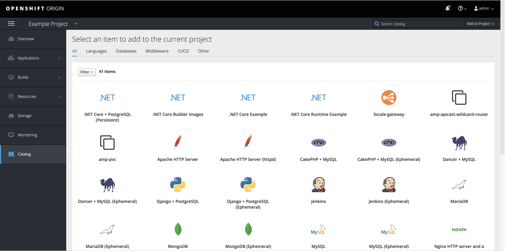
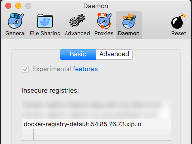
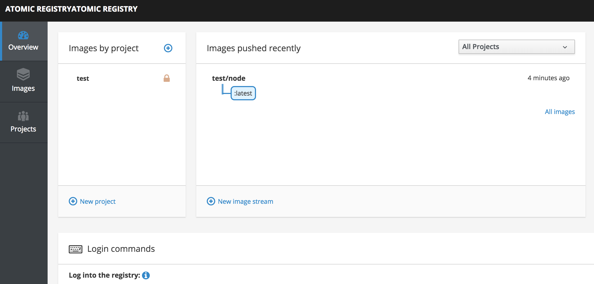

# TERRAFORM + AWS + OPENSHIFT





**Index**

<!-- TOC depthFrom:2 depthTo:6 withLinks:1 updateOnSave:1 orderedList:0 -->

- [Overview](#overview)
- [Prerequisites](#prerequisites)
- [Creating the Cluster](#creating-the-cluster)
- [Installing OpenShift](#installing-openshift)
- [Accessing and Managing OpenShift](#accessing-and-managing-openshift)
	- [OpenShift Web Console](#openshift-web-console)
	- [The Master Node](#the-master-node)
	- [The OpenShift Client](#the-openshift-client)
- [Connecting to the Docker Registry](#connecting-to-the-docker-registry)
- [Additional Configuration](#additional-configuration)
- [Choosing the OpenShift Version](#choosing-the-openshift-version)
- [Destroying the Cluster](#destroying-the-cluster)
- [Makefile Commands](#makefile-commands)
- [Pricing](#pricing)
- [Troubleshooting](#troubleshooting)
- [References](#references)

<!-- /TOC -->

## Overview

Terraform is used to create infrastructure as shown:


Once the infrastructure is set up an inventory of the system is dynamically
created, which is used to install the OpenShift Origin platform on the hosts.

## Prerequisites

You need:

1. [Terraform](https://www.terraform.io/intro/getting-started/install.html) - `brew update && brew install terraform`
2. An AWS account, configured with the cli locally -
```
if [[ "$unamestr" == 'Linux' ]]; then
        dnf install -y awscli || yum install -y awscli
elif [[ "$unamestr" == 'FreeBSD' ]]; then
        brew install -y awscli
fi
```
3. Access to RedHat Cloud AMI and follow the instructions to enable private images and AMI


## Creating the Cluster

Create the infrastructure first:

```bash
# Make sure ssh agent is on, you'll need it later.
eval `ssh-agent -s`

# Create the infrastructure.
make infrastructure
```

You will be asked for a region to deploy in, use `us-east-1` or your preferred region. You can configure the nuances of how the cluster is created in the [`main.tf`](./main.tf) file. Once created, you will see a message like:

```
$ make infrastructure
var.region
  Region to deploy the cluster into

  Enter a value: ap-southeast-1

...

Apply complete! Resources: 20 added, 0 changed, 0 destroyed.
```
That's it! The infrastructure is ready and you can install OpenShift. Leave about five minutes for everything to start up fully.

## Due to an issue with tags on Spot Instances you need to tag manually

Example: kubernetes.io/cluster/easynubetraining, openshift-easynubetraining

## Installing OpenShift

To install OpenShift on the cluster, just run:

```bash
make openshift
```

You will be asked to accept the host key of the bastion server (this is so that the install script can be copied onto the cluster and run), just type `yes` and hit enter to continue.

It can take up to 30 minutes to deploy. If this fails with an `ansible` not found error, just run it again.

Once the setup is complete, just run:

```bash
make browse-openshift
```

To open a browser to admin console, use the following credentials to login:

```
Username: admin
Password: 123
```

## Accessing and Managing OpenShift

There are a few ways to access and manage the OpenShift Cluster.

### OpenShift Web Console

You can log into the OpenShift console by hitting the console webpage:

```bash
make browse-openshift

# the above is really just an alias for this!
open $(terraform output master-url)
```

The url will be something like `https://a.b.c.d.xip.io:8443`.

### The Master Node

The master node has the OpenShift client installed and is authenticated as a cluter administrator. If you SSH onto the master node via the bastion, then you can use the OpenShift client and have full access to all projects:

```
$ make ssh-master # or if you prefer: ssh -t -A ec2-user@$(terraform output bastion-public_dns) ssh master.openshift.local
$ oc get pods
NAME                       READY     STATUS    RESTARTS   AGE
docker-registry-1-d9734    1/1       Running   0          2h
registry-console-1-cm8zw   1/1       Running   0          2h
router-1-stq3d             1/1       Running   0          2h
```

Notice that the `default` project is in use and the core infrastructure components (router etc) are available.

You can also use the `oadm` tool to perform administrative operations:

```
$ oadm new-project test
Created project test
```

### The OpenShift Client

From the OpenShift Web Console 'about' page, you can install the `oc` client, which gives command-line access. Once the client is installed, you can login and administer the cluster via your local machine's shell:

```bash
oc login $(terraform output master-url)
```

Note that you won't be able to run OpenShift administrative commands. To administer, you'll need to SSH onto the master node. Use the same credentials (`admin/123`) when logging through the commandline.

## Connecting to the Docker Registry

The OpenShift cluster contains a Docker Registry by default. You can connect to the Docker Registry, to push and pull images directly, by following the steps below.

First, make sure you are connected to the cluster with [The OpenShift Client](#The-OpenShift-Client):

```bash
oc login $(terraform output master-url)
```

Now check the address of the Docker Registry. Your Docker Registry url is just your master url with `docker-registry-default.` at the beginning:

```
% echo $(terraform output master-url)
https://54.85.76.73.xip.io:8443
```

In the example above, my registry url is `https://docker-registry-default.54.85.76.73.xip.io:8443`. You can also get this url by running `oc get routes -n default` on the master node.

You will need to add this registry to the list of untrusted registries. The documentation for how to do this here https://docs.docker.com/registry/insecure/. On a Mac, the easiest way to do this is open the Docker Preferences, go to 'Daemon' and add the address to the list of insecure regsitries:



Finally you can log in. Your Docker Registry username is your OpenShift username (`admin` by default) and your password is your short-lived OpenShift login token, which you can get with `oc whoami -t`:

```
% docker login docker-registry-default.54.85.76.73.xip.io -u admin -p `oc whoami -t`
Login Succeeded
```

You are now logged into the registry. You can also use the registry web interface, which in the example above is at: https://registry-console-default.54.85.76.73.xip.io



## Persistent Volumes

The cluster is set up with support for dynamic provisioning of AWS EBS volumes. This means that persistent volumes are supported. By default, when a user creates a PVC, an EBS volume will automatically be set up to fulfil the claim.

More details are available at:

- https://blog.openshift.com/using-dynamic-provisioning-and-storageclasses/
- https://docs.openshift.org/latest/install_config/persistent_storage/persistent_storage_aws.html

No additional should be required for the operator to set up the cluster.

Note that dynamically provisioned EBS volumes will not be destroyed when running `terrform destroy`. The will have to be destroyed manuallly when bringing down the cluster.


## Additional Configuration

The easiest way to configure is to change the settings in the [./inventory.template.cfg](./inventory.template.cfg) file, based on settings in the [OpenShift Origin - Advanced Installation](https://docs.openshift.org/latest/install_config/install/advanced_install.html) guide.

When you run `make openshift`, all that happens is the `inventory.template.cfg` is turned copied to `inventory.cfg`, with the correct IP addresses loaded from terraform for each node. Then the inventory is copied to the master and the setup script runs. You can see the details in the [`makefile`](./makefile).

## OpenShift Version

OpenShift 3.10


## Destroying the Cluster

Bring everything down with:

```
terraform destroy
```

Resources which are dynamically provisioned by Kubernetes will not automatically be destroyed. This means that if you want to clean up the entire cluster, you must manually delete all of the EBS Volumes which have been provisioned to serve Persistent Volume Claims.

## Makefile Commands

There are some commands in the `makefile` which make common operations a little easier:

| Command                 | Description                                     |
|-------------------------|-------------------------------------------------|
| `make infrastructure`   | Runs the terraform commands to build the infra. |
| `make openshift`        | Installs OpenShift on the infrastructure.       |
| `make browse-openshift` | Opens the OpenShift console in the browser.     |
| `make ssh-bastion`      | SSH to the bastion node.                        |
| `make ssh-master`       | SSH to the master node.                         |
| `make ssh-node1`        | SSH to node 1.                                  |
| `make ssh-node2`        | SSH to node 2.                                  |
| `make sample`           | Creates a simple sample project.                |

## Pricing

You'll be paying for:

- 1 x m4.xlarge instance
- 2 x t2.large instances


## Troubleshooting

**Image pull back off, Failed to pull image, unsupported schema version 2**

Ugh, stupid OpenShift docker version vs registry version issue. There's a workaround. First, ssh onto the master:

```
$ ssh -A ec2-user@$(terraform output bastion-public_dns)

$ ssh master.openshift.local
```

Now elevate priviledges, enable v2 of of the registry schema and restart:

```bash
sudo su
oc set env dc/docker-registry -n default REGISTRY_MIDDLEWARE_REPOSITORY_OPENSHIFT_ACCEPTSCHEMA2=true
systemctl restart origin-master.service
```


## References

 - https://www.udemy.com/openshift-enterprise-installation-and-configuration - The basic structure of the network is based on this course.
 - https://blog.openshift.com/openshift-container-platform-reference-architecture-implementation-guides/ - Detailed guide on high available solutions, including production grade AWS setup.
 - https://access.redhat.com/sites/default/files/attachments/ocp-on-gce-3.pdf - Some useful info on using the bastion for installation.
 - http://dustymabe.com/2016/12/07/installing-an-openshift-origin-cluster-on-fedora-25-atomic-host-part-1/ - Great guide on cluster setup.
 - [Deploying OpenShift Container Platform 3.5 on AWS](https://access.redhat.com/documentation/en-us/reference_architectures/2017/html-single/deploying_openshift_container_platform_3.5_on_amazon_web_services/)
